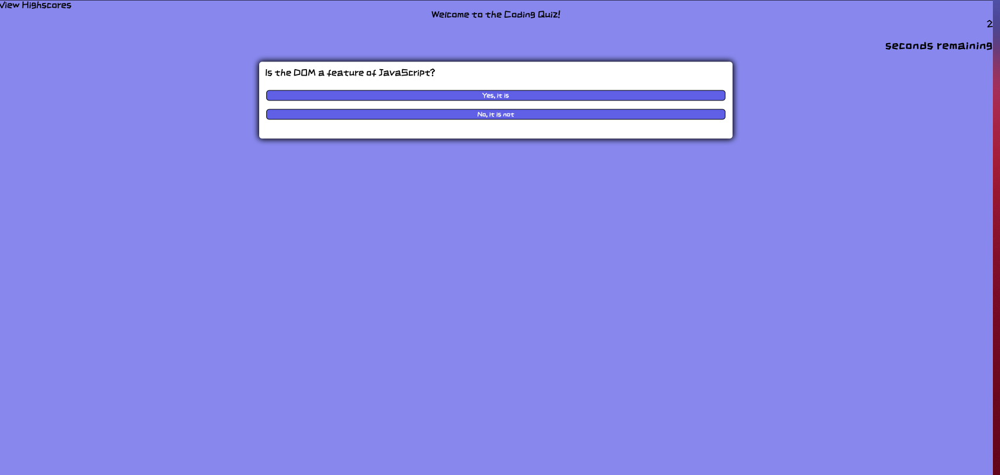

# Coding-Quiz

This is a fun little quiz with some questions about javascript and other important things. My current road block is that (I think) by trying to use event listeners to attach right or wrong values, after the first question, the event listeners stay on the button and sort of pile up, if that makes sense. I think that is why the first question works properly but the next ones don't, because now they have all have an event listener saying wrong even though that is not in the code - leading me to believe this is coming from the event listeners of previous questions. 
## Installation

You can check out the website at the following link: https://drake-g.github.io/Coding-Quiz/

## Photos 

## Usage

This webpage is to be used when you want to take an easy quiz.

